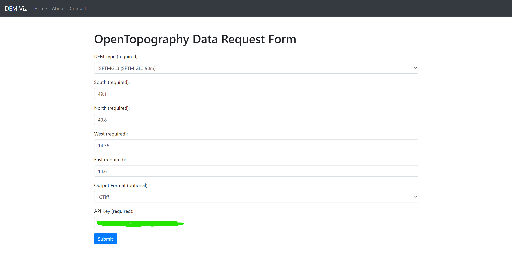
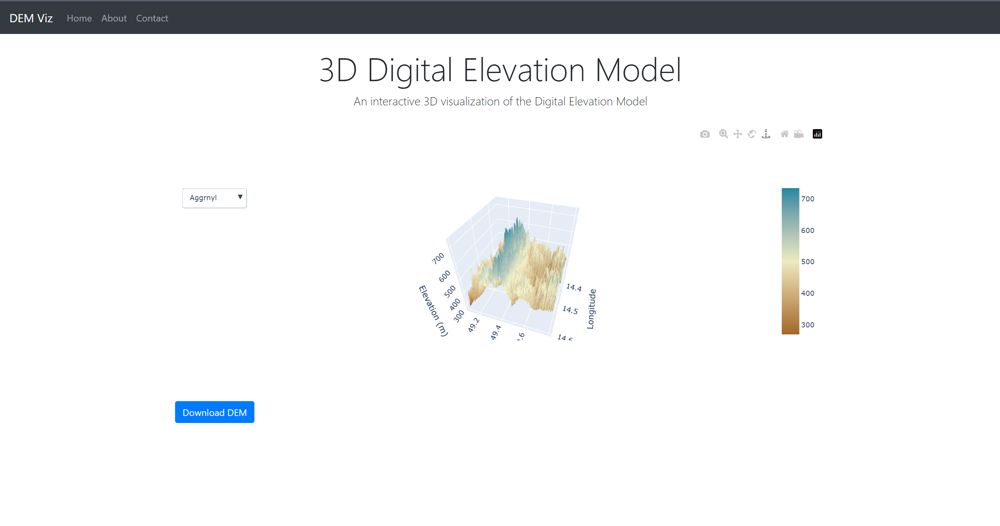

# dem-visualizer-python
A simple data visualizer for DEM files using Python. It uses Django for serving html and plotly for plotting the data as interactive 3D plots. 

_This is a work in progress, Do not judge me based on this. YET._

# Screenshots of the app

